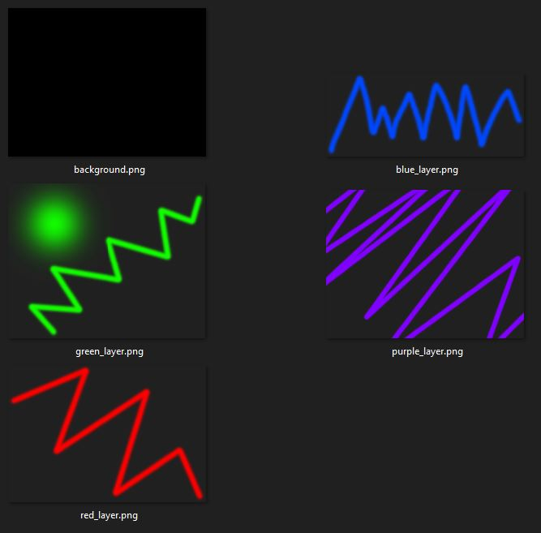

# PhotoshopPy
Read, edit, and render Photoshop files. No Photoshop installation required!


## Usage

#### Print File Info

The most straightforward use of photoshoppy is to get information about a Photoshop file

```python
""" Print information about a file. """
from photoshoppy.psd_file import PSDFile

psd = PSDFile("./tests/psd_files/zig_zags.psd")
psd.print_file_info()
```

```
output:
>  path: C:/Users/a/git/photoshoppy/tests\psd_files\zig_zags.psd
>  resolution: 400x300
>  channels: 3
>  bits per channel: 8
>  color mode: RGB
```

#### Rendering

Photoshoppy's main usefulness is its ability to render PSD files.

```python
""" Render a PSD file to an image. """
from photoshoppy.psd_file import PSDFile
from photoshoppy.psd_render.render import render_psd

psd = PSDFile("./tests/psd_files/zig_zags.psd")
render_psd(psd, "zig_zags.jpg")
```


```python
""" Extract PSD layers to a folder. """
from photoshoppy.psd_file import PSDFile
from photoshoppy.psd_render.render import render_layers

psd = PSDFile("./tests/psd_files/zig_zags.psd")
render_layers(psd, "./layers", skip_hidden_layers=False)
```



